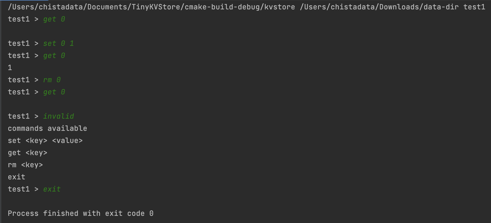

<!-- PROJECT LOGO -->
<br />
<div align="center">

<h3 align="center">TinyKVStore</h3>

  <p align="center">
    A small key value store implementation using lsm and sstable
    <br />
  </p>
</div>


<!-- GETTING STARTED -->
## Getting Started

How to build the store

### Prerequisites

* cmake
* c++ 14

### Installation

1. Clone the repo
   ```sh
   git clone https://github.com/sinsinan/TinyKVStore
   ```
2. Build 
   ```sh
   mkdir build
   cd build
   cmake ..
   cmake --build .
   ```
3. Run
   ```sh
   ./kvstore <data-dir> <table-name>
   ```

## Usage

<a >
    
  </a>


<!-- CONTRIBUTING -->
## Contributing

Contributions are what make the open source community such an amazing place to learn, inspire, and create. Any contributions you make are **greatly appreciated**.

If you have a suggestion that would make this better, please fork the repo and create a pull request. You can also simply open an issue with the tag "enhancement".
Don't forget to give the project a star! Thanks again!

1. Fork the Project
2. Create your Feature Branch (`git checkout -b feature/AmazingFeature`)
3. Commit your Changes (`git commit -m 'Add some AmazingFeature'`)
4. Push to the Branch (`git push origin feature/AmazingFeature`)
5. Open a Pull Request


<!-- ACKNOWLEDGMENTS -->
## Acknowledgments

* [Build a tiny key value store using in Java](https://github.com/x-hansong/TinyKvStore)


